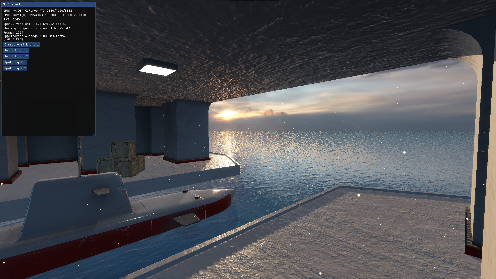

# TideEngine
Tide Engine is an OpenGL renderer made as part of Graphics Programming course at Lodz University of Technology.

## Requirements

* [CMake 3.30 or newer](https://cmake.org/download/)
* [MSVC compiler](https://visualstudio.microsoft.com)
* [Windows 10/11 operating system](https://www.microsoft.com/en-us/software-download/windows11)
* [VCPKG package manager](https://vcpkg.io/en/) (can be installed trough Visual Studio Installer)

## Dependencies
### In project
Packages which source files were added to the thirdparty folder:
* [stb_image](https://github.com/nothings/stb/blob/master/stb_image.h)
* [glad](https://github.com/Dav1dde/glad)
### CPM
Packages installed automatically by CPM:
* [Assimp](https://github.com/assimp/assimp)
* [GLFW](https://github.com/glfw/glfw)
* [GLM](https://github.com/g-truc/glm)
* [spdlog](https://github.com/gabime/spdlog)
### VCPKG
Packages that have to be added to your vcpkg repository:
* [imgui](https://github.com/ocornut/imgui)
* [imguizmo](https://github.com/CedricGuillemet/ImGuizmo)

# Sample Scene
Project's window after succesful building and running the project:

## Features
* PBR materials using Cook-Torrance reflectance model
* Image-based lighting
* Environment mapping
* Directional, spot and point lights using shadow mapping with PCF
* Scene graph
* GPU particle system
* Postprocessing (bloom, tonemapping, gamma correction)

## Controls
WASD - move camera\
Right mouse click + mouse movement - look around\
ESC - close application\
You can choose light from inspector and manipulate its properties using text fields or gizmos.\
E - Translate\
R - Rotate\
T - Scale
